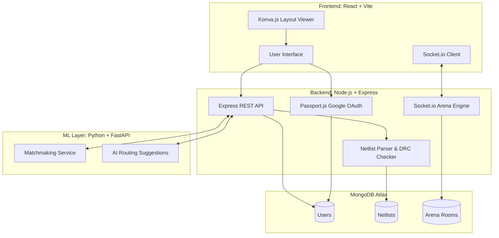
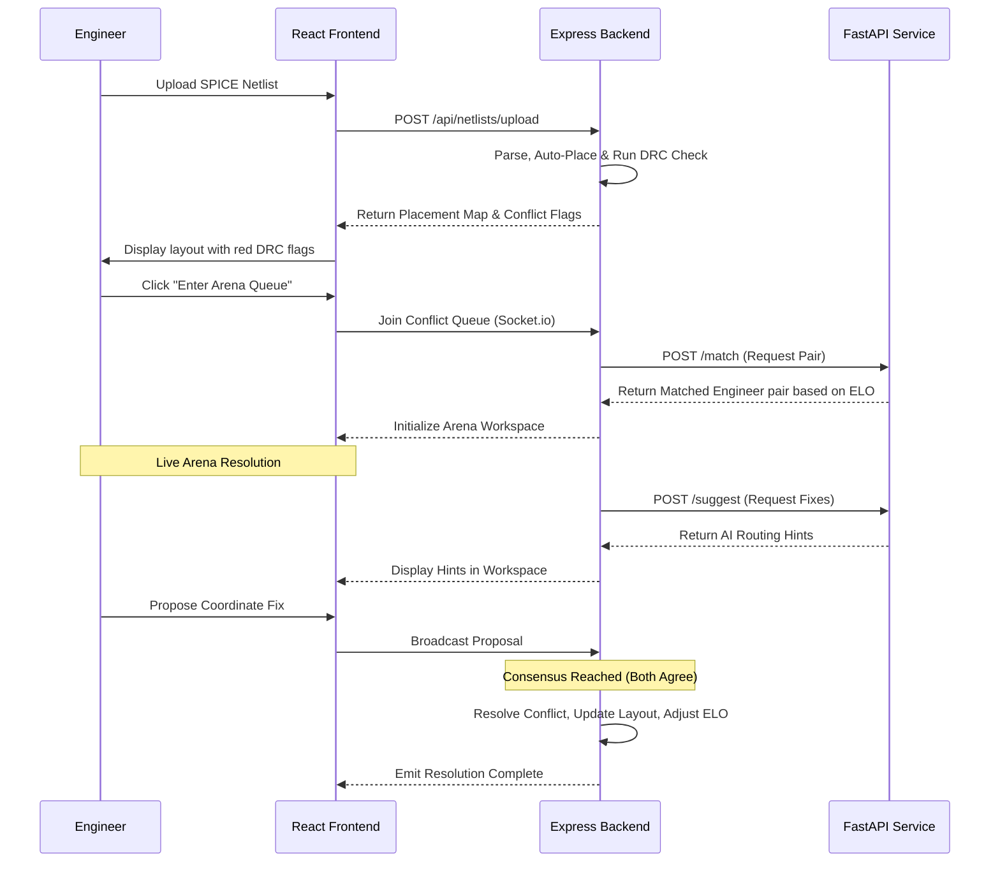

# EpicalFlow

EpicalFlow is a real-time, gamified collaborative platform designed to automate and resolve VLSI layout conflicts. It provides circuit designers and layout engineers with an integrated environment to parse netlists, view auto-placed component layouts, identify Design Rule Check (DRC) violations, and collaboratively resolve routing conflicts through a live, Socket.io-powered Arena workspace.

An intelligent Machine Learning layer handles skill-based matchmaking (ELO scoring) and suggests automated routing fixes to expedite conflict resolution.

## System Architecture

The application is structured as a modular MERN stack web application with an isolated Python/FastAPI microservice handling machine learning computations.



## Resolution Workflow

The core functionality revolves around identifying DRC violations and pairing engineers to resolve them collaboratively.



## Technology Stack

- **Frontend:** React (Vite), React Router, Konva.js (Canvas Rendering), Socket.io-client, Axios, Vanilla CSS.
- **Backend:** Node.js, Express.js, Socket.io, Passport.js (Google OAuth 2.0).
- **Database:** MongoDB Atlas, Mongoose.
- **ML Service:** Python, FastAPI, PyTorch, scikit-learn.
- **Analytics:** pdfkit (Node.js for post-resolution reports).

## Directory Structure

```text
epicalflow/
├── client/          # React frontend (Vite)
├── server/          # Node.js + Express backend
├── ml/              # Python/FastAPI ML service
├── docs/            # Architecture diagrams and documentation
├── docker-compose.yml
└── README.md
```

## Setup Instructions

### Prerequisites
- Node.js (v18+)
- Python (v3.10+)
- MongoDB Atlas cluster URL
- Google Cloud Console OAuth 2.0 Credentials

### 1. Backend Initialization
```bash
cd server
npm install
# Create .env file with MONGO_URI, SESSION_SECRET, GOOGLE_CLIENT_ID, GOOGLE_CLIENT_SECRET
npm run start
```

### 2. Frontend Initialization
```bash
cd client
npm install
# Create .env file with VITE_API_URL pointing to the backend
npm run dev
```

### 3. ML Layer Initialization
```bash
cd ml
python3 -m venv venv
source venv/bin/activate
pip install -r requirements.txt
uvicorn main:app --reload
```

## Team Horizon
Developed for the EPIC Build-A-Thon 2026.
- **Dijo S Benelen:** Repo Architecture, Backend Scaffold, DevOps
- **Sunkireddy Barath:** Frontend Engineering, Konva Canvas Integration
- **Yathish:** Machine Learning Service, FastAPI Integration
- **Sirija Meenakshi & Hemhalatha:** UI/UX, Design Systems
- **Gokul & Divesh:** Real-time Systems, Gamification Logic
